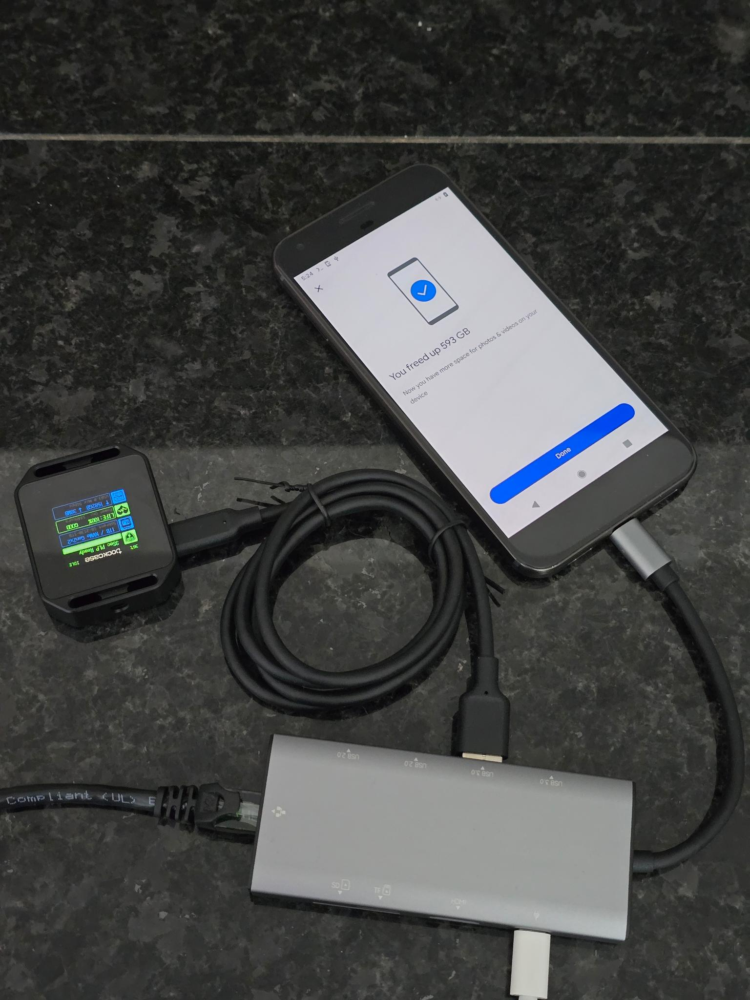

# pixel backup gang

mount ext4 drives & remount VFAT/FAT32 drives into the google pixel's internal storage

> [!WARNING]  
> this code is experimental and there is no guarantee that it works. rooting your phone or running any commands as root can be very dangerous. you have been warned.

anyway here is a demo image of an SSD mounted into the "internal storage" on my Pixel XL. the data is readable & writable in the Google Photos app.



## why? 🤔
from [google support](https://web.archive.org/web/20250725010242/https://support.google.com/photos/answer/6220791?co=GENIE.Platform%3DAndroid&oco=1#zippy=%2Cpixel-st-generation):
>
> > 📱 **Pixel (1st generation)**  
> >> You get unlimited storage in Original quality at no charge.  
> >> You won’t be able to back up in Storage saver.

everyone needs storage. and everyone likes no charge. this sounds great! but of course there's a catch. all media must be backed up through the Google Photos app, which pretends it can only see files located in the device's internal storage.

so everybody painstakingly copies their media into to their pixel's internal storage to get it backed up. some copy photos using FAT32 usb drives. some use FTP transfers. many use [syncthing](https://github.com/syncthing/syncthing) for automation. but i got fed up of transferring photos & videos over unreliable & slow network connections, just to drastically & unnecessarily shorten the flash memory's [limited lifetime](https://en.wikipedia.org/wiki/Flash_memory#Memory_wear). So i started looking into ways to get my unlimited storage without destroying my pixel in the process.

android is kinda just linux, right? so my first thought was to use [NFS](https://en.wikipedia.org/wiki/Network_File_System) to mount a remote filesystem. puny apps won't be able to tell the difference.


> after all, why not? why shouldn't i mount a multi terabyte NAS straight into the DCIM folder on a 32 GB pixel?

alas, the Pixel's kernel wasn't compiled with NFS support (`cat /proc/filesystems`). We can actually add NFS support at runtime using a [linux kernel module](https://wiki.archlinux.org/title/Kernel_module) - however i believe such a module needs to be signed by Google on the stock OS due to [Android Verified Boot](https://source.android.com/docs/security/features/verifiedboot/avb). i then looked into using FUSE (filesystem in user space) based solutions. There are userspace nfs clients like [nfs-ganesha](https://github.com/nfs-ganesha/nfs-ganesha) & local filesystem mounting solutions like [bindfs](https://github.com/mpartel/bindfs) (via [termux root-packages](https://github.com/termux/termux-packages/tree/817ccec622c510929e339285eb5400dbb5b2f4c7/root-packages/bindfs)) and [fuse-nfs](https://github.com/sahlberg/fuse-nfs.git) (complicated to compile for android so i built my own minimal version in Rust). this works and is especially good at sidestepping android 10's selinux policies. however i found FUSE's performance on the pixel to be incredibly slow. (note: i have not tried fbind but i don't think that works out of the box here without using FUSE)

this method is basically a set of hacks around the selinux policies + app sandbox (using the plain old kernel supported `mount` command) to make files on an external storage device look as if they are stored in the device's internal storage.

(if you don't care about using these scripts and just want to see how it's done, take a look at [mount_ext4.sh](scripts/mount_ext4.sh))

### the good
* works with the stock kernel
* backs up external files larger than 4gb (stock OS only supports FAT32 for external drives)
* reduces wear on internal flash storage by up to 50% (see https://github.com/master-hax/pixel-backup-gang/issues/30)
* prevents device from overheating - the external drive gets hot instead
* makes 32gb pixels viable for mass backup

### the bad
* phone needs to be rooted
* there's currently no way to auto-mount when the disk is connected

### the ugly
* there's no GUI, you need to execute shell scripts

## prerequisites
* a Google Pixel (sailfish) or Google Pixel XL (marlin) on Android 10, rooted with [Magisk](https://github.com/topjohnwu/Magisk). may work on other phones.
* a USB storage drive formatted with an ext4 or FAT32 filesystem.

## installation

installation is essentially just copying the scripts to the device & making them executable. you can do this manually, or use one of the automated steps below. you also probably want to disable [Google Play Protect](https://developers.google.com/android/play-protect) scanning in the Play Store menu.

### from internet via pixel terminal
1. start a terminal application and navigate to the directory where you want to install the scripts
1. run the following command:

```sh -c "$(curl -fSs https://raw.githubusercontent.com/master-hax/pixel-backup-gang/install/install.sh)"```

this one-liner runs a small installer script that downloads the latest release archive from github, unpacks it, then makes the contents executable. the current install script can be viewed [here](https://github.com/master-hax/pixel-backup-gang/blob/install/install.sh). piping strange scripts from the web into a root shell is generally not a good idea, but it is convenient. try not to make a habit of it. 😅

### from local repository via adb
1. install the following software: `adb make shellcheck tar` (requires Linux or Windows Subsystem for Linux)
1. clone this repository
1. run `make mobile-install` from the repository root. this installs the scripts to `/data/local/tmp` on the connected android device by default.
   * if your pixel has Termux installed, you can install the scripts to the Termux home directory with `make mobile-install DEVICE_INSTALL_DIRECTORY=/data/data/com.termux/files/home`
   * if you are running these steps on WSL, you should use the adb executable from windows (which has USB support) with `make mobile-install HOST_ADB_COMMAND=/mnt/c/Users/someone/AppData/Local/Android/Sdk/platform-tools/adb.exe`

this is the preferred installation method for development as it doesn't require an internet connection & any changes to the scripts in the local repo are immediately deployed to the pixel

> [!NOTE]  
> The directories `/data/local/tmp` & `/data/data/com.termux/files/home` are known to have less restrictive selinux policies, which allow files to be made executable. Installing the scripts to other directories may not work.


## usage

### setup
1. start a shell on the device & navigate to the installation directory
    * from the device
      * launch [Terminal](https://android.googlesource.com/platform/packages/apps/Terminal/), [Termux](https://github.com/termux/termux-app), [JuiceSSH](https://play.google.com/store/apps/details?id=com.sonelli.juicessh), or some other terminal app
      * run `su` then allow sudo access to your terminal app in Magisk
    * from a PC
      * run `adb shell`
      * run `su` then allow sudo access to the shell process in Magisk
1. run `cd` to navigate to the installation directory e.g. `cd ./pixel-backup-gang` or `cd /data/data/com.termux/files/home/pixel-backup-gang` or `cd /data/local/tmp/pixel-backup-gang`
1. run `./start_global_shell.sh` to enter the global mount namespace
    * the Magisk "force the global mount namespace" doesn't work - maybe it only works for magisk modules?

### mounting

#### ext4 drives (i prefer this because i have files larger than 4gb & ext4 is just [better than FAT32](https://en.wikipedia.org/wiki/Comparison_of_file_systems))
1. connect the ext4 formatted external drive to the pixel. you should get an os notification that says the drive is not supported. clear or ignore this notification.
   * this notification directs you to format the drive in FAT32 - don't do that
1. find the block device that you want to mount. it is usually found at `/dev/block/sdg1` but changes when devices are connected and disconnected e.g. it might show up as `/dev/block/sdh1` when reconnected. run `ls -alh /dev/block/` to see what is in there.
   * if you don't know the filesystem UUID, you can use `./show_devices.sh`. this is just a convenience script, you don't need to run this.
   * if you know the filesystem UUID, you can use `./find_device.sh`. this is just a convenience script, you don't need to run this.
1. run `./mount_ext4.sh <BLOCK_DEVICE>` e.g. `./mount_ext4.sh /dev/block/sdg1`
> [!CAUTION]
> the `mount_ext4.sh` script currently disables [selinux](https://en.wikipedia.org/wiki/Security-Enhanced_Linux) by running `setenforce 0`. you must not have any untrusted apps installed on your device. do not visit untrusted websites. to re-enable selinux, you can reboot your device, or run `setenforce 1` with root permissions. want this fixed? see https://github.com/master-hax/pixel-backup-gang/issues/13 https://github.com/master-hax/pixel-backup-gang/blob/b25a5575fba3897cce126c15ed99245b1335f4c3/scripts/mount_ext4.sh#L41 

#### FAT32 drives (when you only have files < 4gb and/or don't want to disable selinux and/or are a Windows only user unwilling to install a tool like [Ext4Fsd](https://github.com/bobranten/Ext4Fsd.git) and/or are transferring directly from some kind of capture device)
1. connect the FAT32 formatted external drive to the pixel. it should be working normally as removable storage i.e. readable & writable by apps with permission.
1. find the name of folder that the drive is mounted to. it looks like `/mnt/media_rw/2IDK-11F4` - you can check the path displayed in any file explorer app.
1. run `./remount_vfat.sh <MOUNTED_FOLDER>` e.g. `./remount_vfat.sh /mnt/media_rw/2IDK-11F4`

**everything located under `/the_binding` on the external drive should now be visible by apps at `/the_binding` in the internal storage** (the directories are automatically created if they don't already exist)

> [!NOTE]  
> Google Photos will not instantly pick up the new media. It scans the filesystem to update their library when it wants to.
> However, we send a media scan broadcast when the drive is mounted ([ext4](https://github.com/master-hax/pixel-backup-gang/blob/87a0fcc2d4481a54e5c8750bfbf2be8fcee0f50d/scripts/mount_ext4.sh#L52-L54),[VFAT](https://github.com/master-hax/pixel-backup-gang/blob/87a0fcc2d4481a54e5c8750bfbf2be8fcee0f50d/scripts/remount_vfat.sh#L60-L63))
> this is reported to be reliable to get photos to do a scan, however you may need to force close then re-open Google Photos

### unmounting

1. make sure nothing important is reading from or writing to the drive
2. run `./unmount.sh`

**everything located under `/the_binding` in the internal storage should now be gone. you can disconnect the drive if you're sure all pending writes have been flushed.**

## notes
* currently, the ext4 mounting script disables selinux security controls entirely, which is quite unsafe - do not have any kind of untrusted apps installed on your device while using this. selinux remains disabled until the next boot, or you can run the command `setenforce 1` to re-enable it earlier. don't forget that the software on the pixel is severely out of date and there are a lot of serious known vulnerabilities. try to keep device radios off (especially bluetooth and NFC) to reduce the attack surface.
* this scripts in this repo should not make any changes to a pixel that persist past a reboot (besides the scripts themselves existing wherever you saved them)
* my recommendation for regular usage is to find your drive's filesystem UUID using `./show_devices.sh` and store it. you can then use this UUID in a script to always re-mount that same drive without having to figure out what the block device path is at e.g. something like `./mount_ext4.sh $(./find_device.sh ./my_drive_id.txt)`
* list of shell utilities available per android version: https://android.googlesource.com/platform/system/core/+/refs/heads/main/shell_and_utilities/#android-10-api-level-29_quince-tart
* excellent reference: https://android.stackexchange.com/questions/214288/how-to-stop-apps-writing-to-android-folder-on-the-sd-card/257401
