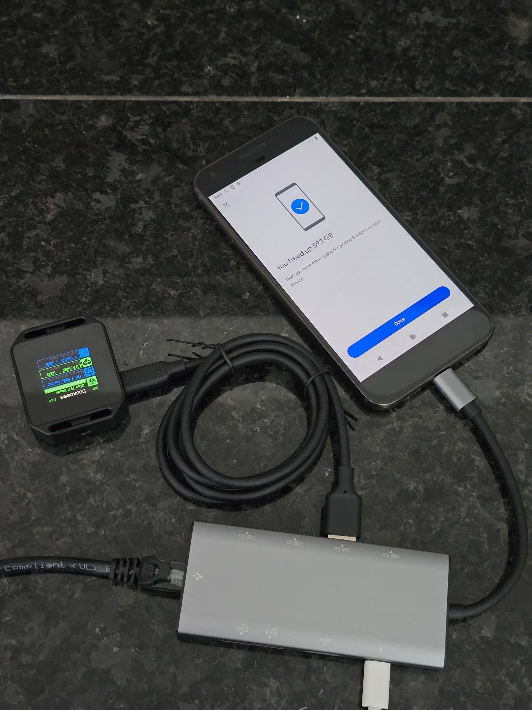

# pixel backup gang

augment the OG pixel's internal storage with an external drive. supports ext4, FAT32, and NFS.

> [!WARNING]  
> this code is experimental and there is no guarantee that it works. rooting your phone or running any commands as root can be very dangerous. you have been warned.

anyway here is a demo image of an SSD mounted into the "internal storage" on my Pixel XL. the data is readable & writable in the Google Photos app.
> #### "You freed up 593 GB"
> 

## why? 🤔
from [google support](https://web.archive.org/web/20250725010242/https://support.google.com/photos/answer/6220791?co=GENIE.Platform%3DAndroid&oco=1#zippy=%2Cpixel-st-generation):
>
> > **Pixel (1st generation)**  
> >> You get unlimited storage in Original quality at no charge. You won’t be able to back up in Storage saver.

everyone needs storage. and everyone likes no charge. this sounds great! just back up your data through the device using the Google Photos app. but there's a catch - the Google Photos app pretends it can only see files located in the device's internal storage.

so everybody painstakingly copies their media into to their pixel's internal storage to get it backed up. some copy photos using FAT32 usb drives. some use FTP transfers. many use [syncthing](https://github.com/syncthing/syncthing) for automation. but i got fed up of transferring photos & videos over unreliable & slow network connections, just to drastically & unnecessarily shorten the flash memory's [limited lifetime](https://en.wikipedia.org/wiki/Flash_memory#Memory_wear). So i started looking into ways to get my unlimited storage without exerting tons of effort just to destroy my pixel in the process.

this project is basically a set of hacks for the operating system to **add an external storage drive into the device's internal storage**.

> #### "After all, why not? why shouldn't i mount a multi terabyte NAS into the DCIM folder on a 32 GB pixel?"
> 

## features
* reduce wear on the internal flash memory
* bypass FAT32's 4 GiB file size limit
* prevent the device from overheating - the external drive gets hot instead
* makes 32 GiB pixels viable for backup

## requirements
* a Google Pixel (sailfish) or a Google Pixel XL (marlin) with an unlockable bootloader
* a USB storage drive or NFS file share
* a basic understanding of how to use a unix-like command-line interface

## getting started
see [docs/EXTERNAL_DRIVES.md](docs/EXTERNAL_DRIVES.md) for prerequisites, installation, and mounting/unmounting instructions for a USB drive (ext4 or FAT32).

for mounting a network (NFS) share instead, see [docs/NETWORK_DRIVES.md](docs/NETWORK_DRIVES.md).
